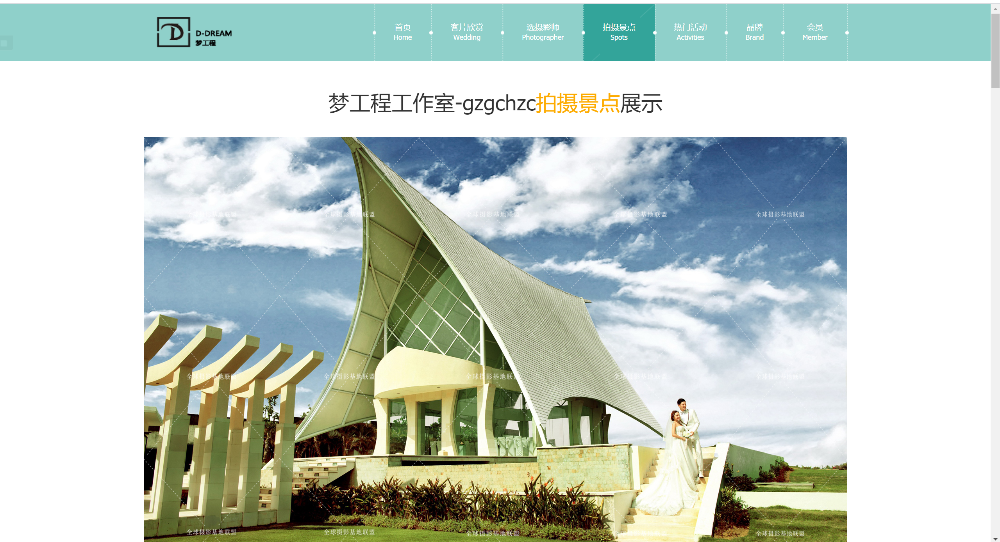
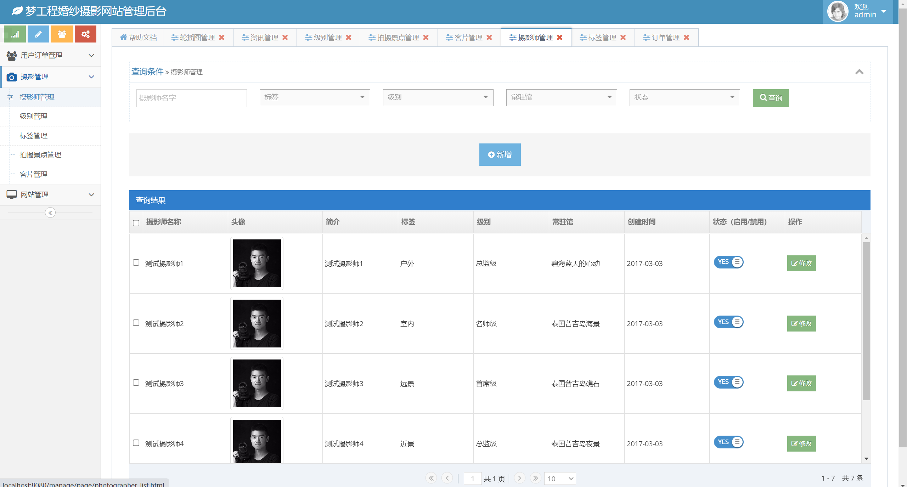
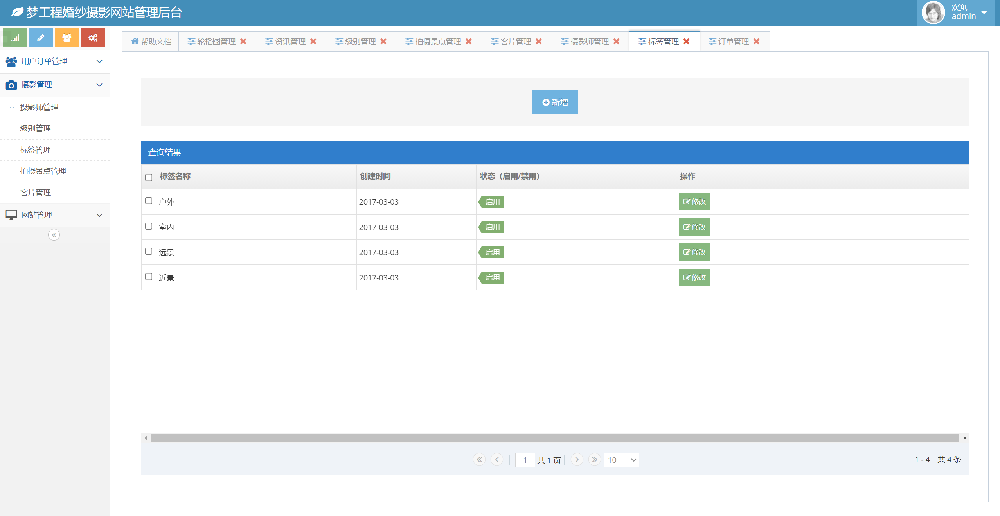
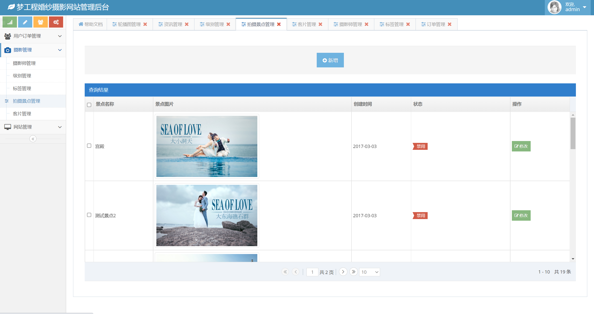
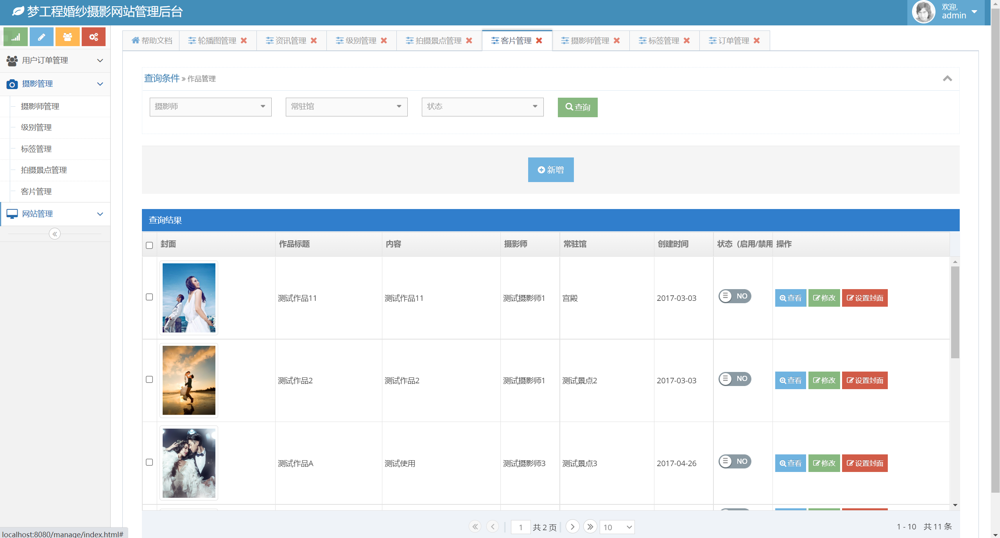

## 基于SpringBoot框架的在线婚纱摄影预订系统

###  获取sql数据库文件: 从戎源码网 (https://armycodes.com/) QQ: 386869957 QQ群: 377586148
###  所有系统地址: (https://github.com/YuLin-Coder/AllProjectCatalog) 
###  所有项目以及源代码本人均调试运行无问题 可支持远程安装部署调试、定制修改、代码讲解

## 项目介绍
基于SpringBoot框架的在线婚纱摄影预订系统，有用户和管理员两个角色，主要功能如下
用户在系统前端选择摄影套餐，预订摄影师。 后台管理员根据用户反馈的的信息进行订单维护，
包括婚纱等一系列基础维护。
前台展示页面包含：首页、客片欣赏、选摄影师、提交预约申请订单、拍摄景点展示、热门活动、品牌、会员等菜单，
后台管理页面包含：用户订单、摄影管理(摄影师管理、级别管理、标签管理、拍摄景点管理、客片管理)、
网站管理(轮播图管理、资讯管理)

## 项目技术
- 编程语言：Java
- 数据库：MySQL
- 项目管理工具：Maven
- 前端技术：HTML+jQuery+Layui+ECharts+bootstrap
- 后端技术：Spring、SpringMVC、MyBatis

## 运行环境
- JDK版本：JDK1.8及以上
- 开发工具：IDEA、Ecplise、Myecplise都可以
- 数据库: MySQL5.7及以上
- Maven：maven3.0及以上

## 运行截图

