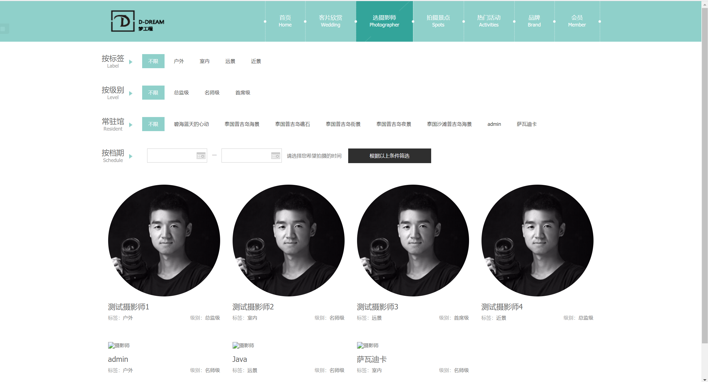

## 基于SpringBoot框架的在线婚纱摄影预订系统

- <b>完整代码获取地址：从戎源码网 ([https://armycodes.com/](https://armycodes.com/))</b>
- <b>技术探讨、资料分享，请加QQ群：692619798</b> 
- <b>作者微信：19941326836  QQ：952045282</b> 
- <b>承接计算机毕业设计、Java毕业设计、Python毕业设计、深度学习、机器学习</b>
- <b>选题+开题报告+任务书+程序定制+安装调试+论文+答辩ppt 一条龙服务</b>
- <b>所有选题地址 ([https://github.com/YuLin-Coder/AllProjectCatalog](https://github.com/YuLin-Coder/AllProjectCatalog)) </b>

## 项目介绍
基于SpringBoot框架的在线婚纱摄影预订系统，有用户和管理员两个角色，主要功能如下
用户在系统前端选择摄影套餐，预订摄影师。 后台管理员根据用户反馈的的信息进行订单维护，
包括婚纱等一系列基础维护。
前台展示页面包含：首页、客片欣赏、选摄影师、提交预约申请订单、拍摄景点展示、热门活动、品牌、会员等菜单，
后台管理页面包含：用户订单、摄影管理(摄影师管理、级别管理、标签管理、拍摄景点管理、客片管理)、
网站管理(轮播图管理、资讯管理)

## 项目技术
- 编程语言：Java
- 数据库：MySQL
- 项目管理工具：Maven
- 前端技术：HTML+jQuery+Layui+ECharts+bootstrap
- 后端技术：Spring、SpringMVC、MyBatis

## 运行环境
- JDK版本：JDK1.8及以上
- 开发工具：IDEA、Ecplise、Myecplise都可以
- 数据库: MySQL5.7及以上
- Maven：maven3.0及以上

## 运行截图

